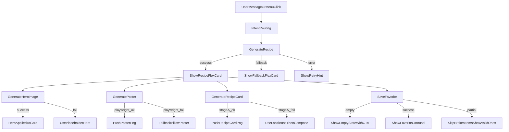

# UX Playbook

此文件是 UI/UX 的執行規格補充，目標是讓 LINE Flex、食譜海報、食譜圖卡三個表面在狀態、語氣、可及性與流程上維持一致。

## 1) Interaction State Matrix

| Feature | Loading | Empty | Error | Success | Partial |
|---|---|---|---|---|---|
| 食譜生成（Flex） | 顯示「廚房準備中」短訊息並保留主選單按鈕 | 回「目前沒有可用食材內容」，給 `換菜單` / `清除記憶` CTA | 顯示友善錯誤與重試行為，不暴露原始 provider payload | 回傳完整 recipe flex 卡片 | 回傳 fallback flex（可讀摘要 + 再試一次） |
| 主圖生成（Hero） | 回「正在生成主圖」並保留原食譜內容可讀 | 無主圖時顯示文字 hero block | 生成失敗回退 placeholder，不中斷主流程 | 主圖可嵌入 Flex hero 並可存快取 | 圖片可用但媒體 URL 不可用時，回文字提示且不中斷 |
| 海報生成（Poster） | 回「正在生成海報」進度訊息 | 無步驟/食材時仍輸出最小海報模板 | Playwright 失敗時回退 Pillow | 成功 push 圖片（含可讀中文） | 主圖缺失時使用 placeholder hero，不中斷 |
| 圖卡生成（Card） | 回「正在生成圖卡」提示 | 缺欄位時以預設值補齊（不輸出空白版） | Stage A 失敗改本地 fallback 底圖 | 成功輸出最終 PNG 並推送 | hero 下載失敗時仍輸出無 hero 版本 |
| 收藏清單（Favorites） | 回「正在讀取收藏」提示 | 顯示「尚未收藏食譜」+ `換菜單` CTA | DB 失敗提示稍後重試 | 輪播卡正常顯示並可刪除/重做 | 有部分壞資料時略過壞項，仍顯示可用項目 |

## 2) A11y Baseline (Minimum)

- 色彩對比：一般文字最少 `4.5:1`，大型字最少 `3:1`。
- 最小文字尺寸：內文不低於 `14px`（等效），輔助文字不低於 `12px`。
- 觸控目標：可點元素最小 `44x44px`（LINE 按鈕、Web 按鈕一致）。
- 文本可理解性：錯誤文案需提供「可執行下一步」（重試、返回、聯絡管理員）。
- Web 語意：
  - 標題順序維持 `h1 -> h2` 階層。
  - 鍵盤焦點順序與視覺順序一致。
  - 列表內容使用語意元素（`ul/li`）。
- 圖像替代策略：
  - 主圖失敗不得造成空白卡；必須有文字 hero 或 placeholder。
  - 任何 fallback 都要保持主要資訊可讀。

## 3) Microcopy Guideline

### Loading

- 「👨‍🍳 廚房準備中，正在幫你整理最佳版本…」
- 「🖼 主圖生成中，稍等一下就上桌。」
- 「🧾 圖卡製作中，正在排版重點步驟。」
- 「📌 正在整理你的收藏清單…」

### Error (Recoverable)

- 「這次火候不對，我再試一次。你也可以先點『清除記憶』再重來。」
- 「目前連線有點不穩，請稍後重試。」
- 「主圖暫時生成失敗，先用文字版本給你，不影響食譜內容。」
- 「目前無法讀取收藏，稍後再試一次就好。」

### Success

- 「上桌完成，這是你今天的料理提案。」
- 「主圖已完成，已套用到食譜卡。」
- 「海報已完成，可直接分享。」
- 「已幫你收藏，下次可從『我的最愛』快速重做。」

### Tone Rules

- 優先使用「可操作下一步」句型，不只描述錯誤。
- 避免責怪語氣（如「你輸入錯誤」），改用協作語氣（如「我幫你重試」）。
- 同一狀態在不同表面語氣一致：短句、溫暖、可執行。

## 4) IA Flow Map (User-Centric)

## 5) Acceptance Checklist

- 五大功能皆有 loading/empty/error/success/partial 定義。
- 任一失敗都能看到可執行下一步（重試/返回/保留內容）。
- 三個表面（Flex/海報/圖卡）的語氣一致。
- fallback 不會讓主要內容消失或變不可讀。
