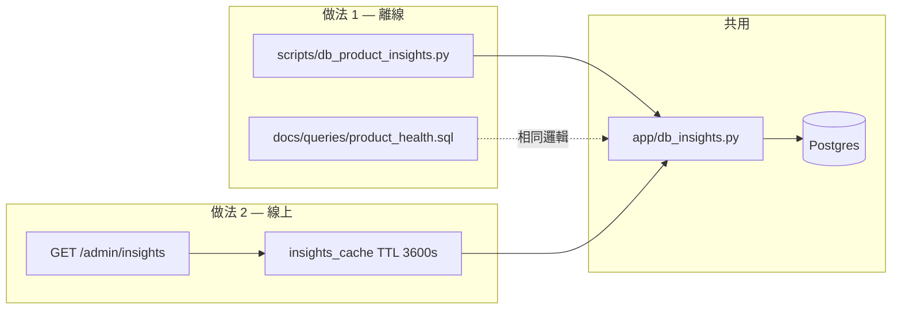

# 資料庫產品洞察與 Admin 健康檢查 — 設計規格

**日期**：2026-05-22  
**狀態**：已核准（含做法 1 + 做法 2）  
**優先目標**：A 產品成長／留存、C 可觀測性／技術債  
**範圍外**：B 金流 webhook、新付費方案、做法 3 事件表（除非掃描後 jsonb 成為瓶頸）

---

## 1. 背景與問題

職人料理大腦的 Postgres 已持久化對話記憶、收藏、菜系情境、每日用量與 `usage_ledger`，但：

- 營運無法快速回答「誰在回來、什麼菜受歡迎、收藏轉換如何」。
- `user_preferences` 有表且 AI 會讀，**應用層無寫入路徑**，難以驗證個人化是否生效。
- `GET /metrics` 僅反映進程內 counter（佇列、AI 錯誤），**不含 DB 聚合**。
- 分析依賴手動 `psql` 或臨時 SQL，易與 schema 漂移。

本設計以**唯讀聚合**補齊 A/C，不變更 webhook 熱路徑語意。

---

## 2. 目標

| ID | 目標 | 成功標準 |
|----|------|----------|
| G1 | 可重複的 DB 健康／產品報告 | 設定 `DATABASE_URL` 後，一條指令產出 Markdown 報告 |
| G2 | 營運可定期看核心 KPI | `GET /admin/insights` 回 JSON，帶 1h 快取 |
| G3 | 技術債可量化 | 報告含 preferences 空置率、memory jsonb 體積、ledger 一致性警示 |
| G4 | 安全與隱私 | 僅 SELECT；對外 JSON 不含完整 `user_id` |

---

## 3. 架構概覽



**原則**：查詢邏輯集中在 `app/db_insights.py`；腳本與 Admin 端點共用，避免 SQL 雙份維護。

---

## 4. 做法 1：離線報告

### 4.1 `scripts/db_product_insights.py`

- CLI：`python3 scripts/db_product_insights.py [--tenant default] [--days 30] [--out reports/...]`
- 環境：`DATABASE_URL`（與 `init_db.py` 相同）；未設定則 exit 1 並印說明。
- 輸出：預設 `reports/db-insights-YYYYMMDD-HHMM.md`；`--json` 可改 stdout JSON。
- 章節：
  1. **規模**：各表 row count、`tenant_id` 分布
  2. **留存（A）**：`usage_daily` 之 WAU、活躍天數直方（1/2/3+ 天）、近 N 日有請求的不重複 user
  3. **參與（A）**：`user_memory` 用戶數、平均 history 輪數（jsonb array length）、`favorite_recipes` 用戶數、**收藏轉換率**（有收藏／有記憶）
  4. **內容（A）**：`favorite_recipes` Top 10 `recipe_name`、`user_cuisine_context` 菜系分布
  5. **技術債（C）**：`user_preferences` 非空列數與比例；`user_memory` avg/max `pg_column_size(history)`；`usage_daily` 近 N 日 sum vs `usage_ledger` sum 差異警示（允許小誤差，僅 flag）
  6. **建議優先序**：依門檻自動產生文字（見 §7），標記 `needs_review` 若樣本過小（例如總 user &lt; 5）

### 4.2 `docs/queries/product_health.sql`

- 與 `db_insights.py` 內查詢**語意一致**的純 SQL 片段，供 Render Shell 手動執行。
- 檔案頂部註明：以 migration 為準；變更 schema 時同步改 `app/db_insights.py`。

---

## 5. 做法 2：`GET /admin/insights`

### 5.1 路由

```
GET /admin/insights?tenant_id=default&days=30
Header: X-Admin-Token: <ADMIN_API_TOKEN>
```

- 未設定 `ADMIN_API_TOKEN` → **503**（與現有 `/admin/subscriptions` 一致）。
- Token 錯誤 → **403**。
- 未設定 `DATABASE_URL` → **503**，body 說明需 Postgres。
- **不**套用 `enforce_public_rate_limit`；建議僅內網或 VPN 呼叫。可選：未來加 `RATE_LIMIT_ADMIN_PER_MINUTE`（本輪 YAGNI）。

### 5.2 回應 JSON（精簡 KPI 子集）

```json
{
  "ok": true,
  "tenant_id": "default",
  "window_days": 30,
  "generated_at": "2026-05-22T12:00:00+00:00",
  "cached": true,
  "cache_ttl_sec": 3600,
  "scale": {
    "users_with_memory": 120,
    "users_with_usage_30d": 45,
    "favorite_rows": 80
  },
  "retention": {
    "wau_30d": 45,
    "users_active_2plus_days_30d": 12
  },
  "engagement": {
    "favorite_conversion_rate": 0.35,
    "avg_history_turns": 4.2
  },
  "content": {
    "top_recipe_names": [{"name": "番茄炒蛋", "count": 8}]
  },
  "health": {
    "preferences_nonempty_rate": 0.0,
    "memory_history_avg_bytes": 8192,
    "usage_ledger_mismatch": false
  },
  "recommendations": [
    {"priority": "P0", "code": "prefs_write_missing", "message": "..."}
  ]
}
```

- `top_recipe_names` 最多 5 筆。
- `recommendations` 與離線報告共用規則引擎（§7）。

### 5.3 快取

- 模組級 `app/insights_cache.py` 或 `db_insights` 內簡單 dict：key = `f"{tenant_id}:{days}"`，value = `(expires_at, payload)`。
- TTL：**3600 秒**（常數 `INSIGHTS_CACHE_TTL_SEC`，可經 env 覆寫 `ADMIN_INSIGHTS_CACHE_TTL_SEC`）。
- 快取命中時 `cached: true`；過期後單飛行：asyncio Lock per key，避免 thundering herd。
- DB 查詢在 `asyncio.to_thread` 執行，不阻塞 event loop。

### 5.4 與 `GET /metrics` 的關係

- **不**把 DB 聚合寫入 `observability.incr`（避免 scrape 時打 DB）。
- 可選：查詢成功／失敗時 `incr("admin.insights.queries_total")` 等輕量 counter（本輪可選）。

---

## 6. `app/db_insights.py` 查詢契約

| 函式 | 說明 |
|------|------|
| `collect_insights(tenant_id: str, days: int) -> dict` | 同步；執行所有 SELECT，回傳可 JSON 序列化 dict |
| `build_recommendations(snapshot: dict) -> list[dict]` | 純函式；依門檻產生 P0–P3 建議 |
| `format_markdown_report(snapshot: dict) -> str` | 離線報告用 |

**查詢約定**：

- 所有查詢帶 `tenant_id = %s`（除全庫 scale 可選 `tenant_id IS NOT DISTINCT FROM %s`）。
- 時間窗：`days` 預設 30，上限 90（防止全表掃過久）。
- 不使用 `user_id` 明文出現在對外 JSON；內部聚合僅 `COUNT(DISTINCT user_id)`。

**依賴表**（現有 migration）：`user_memory`, `user_preferences`, `favorite_recipes`, `user_cuisine_context`, `usage_daily`, `usage_ledger`, `subscriptions`（scale 用，非 A 主軸）。

---

## 7. 建議規則引擎（A + C）

| code | 條件 | priority | 產品動作 |
|------|------|----------|----------|
| `prefs_write_missing` | `preferences_nonempty_rate < 0.05` 且 `users_with_memory >= 10` | P0 | 實作偏好編輯 + `save_user_preferences` |
| `low_favorite_conversion` | `favorite_conversion_rate < 0.15` 且 memory users ≥ 10 | P1 | 強化收藏 CTA／我的最愛入口 |
| `low_wau_ratio` | `wau_30d / users_with_memory < 0.2` | P2 | 回訪 push／「上次食譜」流程（另 spec） |
| `memory_jsonb_large` | `memory_history_avg_bytes > 65536` | P3 | 歸檔或截斷策略 |
| `usage_ledger_mismatch` | daily sum 與 ledger sum 差異 &gt; 5% | P1 (C) | 查 quota 寫入與 `REQUIRE_ATOMIC_USAGE` |

樣本不足（`users_with_memory < 5`）時只回 `insufficient_data`，不產生 P0/P1。

---

## 8. 安全與隱私

- 腳本與 Admin API：**僅 SELECT**。
- 建議 Render 建立**唯讀** DB role 供本機／CI 跑腳本；正式 Web Service 仍用讀寫 role（Admin 只讀聚合）。
- 報告檔案勿 commit 進 git（`reports/` 加入 `.gitignore`）。
- `ADMIN_API_TOKEN` 與 `METRICS_TOKEN` 分離；insights 不暴露對外公開路由。

---

## 9. 測試

| 類型 | 內容 |
|------|------|
| 單元 | `build_recommendations` 門檻邊界；`format_markdown_report` 快照 |
| 整合 | `tests/integration/test_db_insights.py`：沿用 `DATABASE_URL`，migration 後插入 fixture，驗證 `collect_insights` 計數與轉換率 |
| 路由 | `test_admin_insights_requires_token`、503 無 DB、快取第二次 `cached: true`（mock cache TTL 或用 monkeypatch） |

---

## 10. 文件與里程碑收尾

實作完成後同一批變更更新：

- `README.md`：Admin API 表新增 `GET /admin/insights`；環境變數 `ADMIN_INSIGHTS_CACHE_TTL_SEC`
- `CHANGELOG.md`：新腳本與端點
- `TODOS.md`：勾選「DB 健康檢查」；依報告結果保留 P0 偏好編輯等項

---

## 11. 實作順序（供 writing-plans 使用）

1. `app/db_insights.py` + 單元測試（recommendations）
2. `docs/queries/product_health.sql`
3. `scripts/db_product_insights.py` + `.gitignore` `reports/`
4. `insights_cache` + `GET /admin/insights` + 路由測試
5. 整合測試（Postgres）
6. 文件三件套

---

## 12. 風險與緩解

| 風險 | 緩解 |
|------|------|
| 大表全掃慢 | `days` 上限 90；查詢皆帶時間過濾；必要時加 `usage_daily(usage_date)` 已有 PK 覆蓋 |
| Admin 端點被掃 | 強 token、不公開文件 URL、可選 IP allowlist（未來） |
| jsonb 分析慢 | 本輪僅 `jsonb_array_length` 與 `pg_column_size`；不做全文搜尋 |
| 多實例快取不一致 | 可接受（KPI 非強一致）；必要時改 Redis（YAGNI） |

---

## 13. 核准記錄

- 2026-05-22：產品方確認目標 **A + C**，採納 **做法 1 + 做法 2**（用戶訊息：「可以，順便做作法2吧」）。
