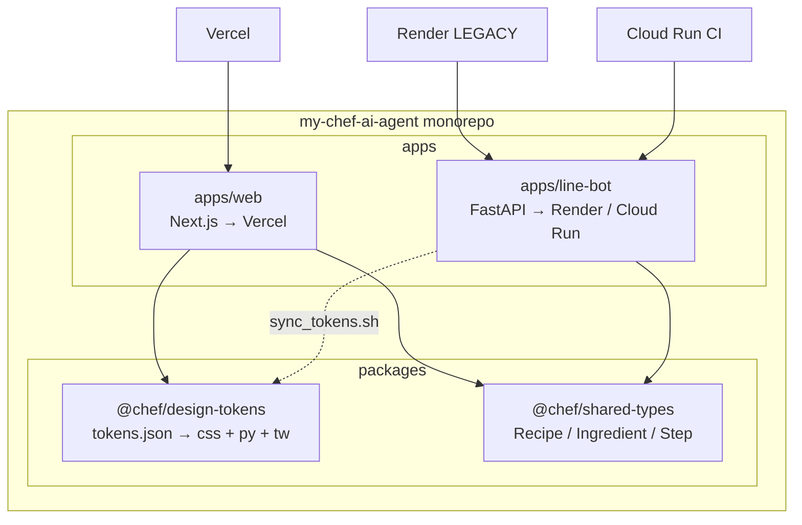

# Monorepo + Design Tokens 重構 — 設計規格

**日期**：2026-05-22  
**狀態**：已核准  
**決策**：pnpm workspace；W3C DTCG + `@chef/design-tokens`；不引入 Turborepo／Nx；LINE `design_tokens` 薄包裝 + 23 符號零變更；`_generated_tokens.py` 入版控；Docker context = repo 根；LINE 部署雙軌（Cloud Run primary、Render LEGACY）；Web 本階段僅 CSS variables；`tests/` 暫留根目錄  
**目標**：在 Recipe Library 擴張前，建立 Web／LINE 獨立 build／deploy 邊界，並以單一 token 來源消除 Python／TypeScript 色票漂移

---

## 1. 背景

### 現況

倉庫為**單一根目錄**混放：

- `web/` — 現行 **Next.js** 產品（Vercel，Root Directory = `web`）
- `app/` + `main.py` — **封存但可部署**的 LINE FastAPI Bot（Render `render.yaml`、Dockerfile、GitHub Actions 另部署 **Cloud Run**）
- 根目錄 `tests/`、`migrations/`、`init_db.py` — Python 測試與 DB schema（Web Neon 共用）

設計語彙目前以 `app/design_tokens.py` 為 Python **唯一色票來源**；`flex_theme.py`、`ui_contracts.py`、海報／圖卡模組皆映射自該檔。Web 端則在 `globals.css`、`recipe-poster-html.ts` 等處**手寫相同 hex**，與 Python 無機械同步。

### 痛點（為何現在做）

| # | 痛點 | 影響 |
|---|------|------|
| P1 | **Token 雙寫**：TS/CSS 與 Python 各維護一套暖色 hex | 任一側改色易漏改，視覺漂移（已出現在 Web 海報 HTML） |
| P2 | **CI／部署未分離**：push `main` 觸發整包 pytest + Cloud Run；改 `web/` 無法避免觸發 LINE 部署語意 | 浪費時間、誤觸封存路徑 deploy |
| P3 | **共享領域無處安放**：Recipe／Ingredient／Step 將由 Web Recipe Library 擴張，TS 與 Python 將重複定義 schema | 下一階段技術債會指數成長 |

Recipe Library（Prompt 2）即將動到資料模型與 UI；**本次為遷移 monorepo + token 管線的最後合理窗口**，不阻塞產品功能但降低後續 18+ 檔搬遷風險。

---

## 2. 目標與非目標

### 目標

| ID | 說明 |
|----|------|
| M1 | `apps/web` 與 `apps/line-bot` 各自獨立 **install / build / test**；path-filter CI 僅在相關目錄變更時跑對應 job |
| M2 | `@chef/design-tokens` 為 **兩語言色票單一來源**（`tokens.json` → CSS、Tailwind preset、Python） |
| M3 | 既有 LINE Bot **pytest 153 則零回歸**（含 `test_design_token_consistency`） |
| M4 | **Vercel** 與 **LINE 部署**（Render 和／或 Cloud Run）成功；§9 列出 Dashboard 手動變更 checklist |
| M5 | `@chef/shared-types` **套件骨架**就緒（Recipe／Ingredient／Step 型別 exports，實作可為空殼） |

### 非目標（本階段明確排除）

- 不引入 **Turborepo / Nx** 等 remote cache 編排
- 不改 LINE Bot **業務邏輯**（handlers、Flex 排版、佇列、AI 流程）
- 不改 Web **業務邏輯**（僅 import path、build、樣式管線）
- 不引入新 **ORM** 或改 DB access layer（留給 Recipe Library spec）
- 不實作 **Recipe Library** UI／API（僅鋪 `shared-types`）
- 不強制 **datamodel-code-generator** 同步 Python↔TS（見 §12 Q6）
- 不將 **Dark mode** 視覺上線（schema 可預留，預設僅 light）

---

## 3. 架構



| 層 | 技術 | 備註 |
|----|------|------|
| 工作區 | **pnpm workspace**（根 `pnpm-workspace.yaml`） | `apps/*`、`packages/*`；Python 仍用 `requirements.txt` per app |
| Web | Next.js 15 App Router | `apps/web`；Vercel Root Directory 改為 `apps/web` |
| LINE | FastAPI + uvicorn | `apps/line-bot`；`main.py` 移入或 re-export |
| Tokens | W3C DTCG JSON + 自寫 `build.ts` | 輸出 `dist/tokens.css`、`dist/tailwind-preset.js`、`dist/tokens.py` |
| 型別 | `@chef/shared-types`（TypeScript） | Phase 5 空殼；Python 手寫對應延後 |
| CI | GitHub Actions path filters | `web/**` 不跑 Playwright；`apps/line-bot/**` 不跑 `next build` |
| DB | 根目錄 `migrations/`、`init_db.py` | 維持 repo 根共享，兩 app 皆引用 |

---

## 4. 目錄結構

```text
my-chef-ai-agent/
├── pnpm-workspace.yaml
├── package.json                 # 根 scripts: tokens:build, lint:workspace
├── apps/
│   ├── web/                     # 自 web/ 搬入
│   │   ├── app/
│   │   ├── components/
│   │   ├── lib/
│   │   ├── package.json         # @chef/web
│   │   └── vercel.json
│   └── line-bot/                # 自 app/ + main.py 搬入
│       ├── app/                 # 原 Python app 套件
│       ├── main.py
│       ├── Dockerfile           # 或根 Dockerfile 改 context
│       ├── requirements.txt     # 可 symlink 或 copy 根檔
│       └── scripts/
│           └── sync_tokens.sh
├── packages/
│   ├── design-tokens/
│   │   ├── tokens.json          # W3C DTCG 單一來源
│   │   ├── build.ts
│   │   ├── package.json         # @chef/design-tokens
│   │   └── dist/                # 生成物（見 §12 Q4 是否入 git）
│   └── shared-types/
│       ├── src/index.ts
│       └── package.json         # @chef/shared-types
├── migrations/                  # 不搬
├── init_db.py
├── tests/                       # 暫留根目錄；pytest root = apps/line-bot
├── render.yaml                  # 路徑更新指向 apps/line-bot
├── docs/
└── …
```

---

## 5. Package 契約

### `@chef/design-tokens`

| 項目 | 內容 |
|------|------|
| **exports** | `./css` → `dist/tokens.css`；`./tailwind` → `dist/tailwind-preset.js`；`./python` → `dist/tokens.py`（文件路徑；執行期 LINE 用 sync 複本） |
| **build** | `pnpm tokens:build` → `tsx packages/design-tokens/build.ts` |
| **artifacts** | `tokens.css`（`:root` + `[data-theme=dark]` 預留）、`tailwind-preset.js`、`tokens.py`（模組級常數 + `hex_to_rgb`） |
| **來源** | 初版自 `app/design_tokens.py` **萃取** hex 至 `tokens.json`，不以手抄雙份維護 |

```ts
// apps/web — 消費範例（Prompt 1 實作後）
import "@chef/design-tokens/css";
// tailwind.config.ts
import chefPreset from "@chef/design-tokens/tailwind";
```

```python
# apps/line-bot/app/design_tokens.py — 薄包裝（§8）
from app._generated_tokens import *  # noqa: F403
```

### `@chef/shared-types`

| 項目 | 內容 |
|------|------|
| **exports** | `.` → `src/index.ts` |
| **Phase 5 內容** | `Recipe`, `Ingredient`, `Step`, `KitchenTalkLine` 等 **interface 空殼或最小欄位** |
| **依賴** | 無 runtime 依賴；`apps/web` 以 `workspace:*` 引用 |

### `apps/web`（`@chef/web`）

| 項目 | 內容 |
|------|------|
| **depends** | `@chef/design-tokens`, `@chef/shared-types`, 既有 next/openai/neon |
| **build** | `pnpm --filter @chef/web build`；前置 `pnpm tokens:build` |
| **Vercel** | Root Directory = **`apps/web`**；Install = `pnpm install --frozen-lockfile`（repo 根執行，見 §9） |

### `apps/line-bot`

| 項目 | 內容 |
|------|------|
| **depends** | Python requirements；build 前 `scripts/sync_tokens.sh` |
| **sync** | 將 `packages/design-tokens/dist/tokens.py` → `app/_generated_tokens.py` |
| **Docker** | build context = **monorepo root**（§12 Q5）；`COPY` 含 `packages/design-tokens/dist` 或 CI 先 build |
| **entry** | `uvicorn main:app`（`WORKDIR` = `apps/line-bot`） |

---

## 6. Design Tokens Schema

採 **[W3C Design Tokens Format](https://www.designtokens.org/tr/2025.10/format/)**（DTCG）`$type` / `$value`，檔案 `packages/design-tokens/tokens.json`。

### Light / Dark dual-mode

- **本階段僅 light `$value` 有實值**；dark 以相同 key 結構填 **與 light 相同 hex** 或 `$extensions.chef.deprecated: true` 占位，避免生成器分支爆炸。
- Web 使用 `[data-theme="dark"]` selector 預留；**不承諾** dark 視覺驗收。
- 語意 token 名稱採 **`color.background.default`** 階層，生成時 flatten 為 `BACKGROUND`（Python）與 `--color-background-default`（CSS）。

### Token 類別（本專案範圍）

| 類別 | DTCG `$type` | 本階段 |
|------|--------------|--------|
| `color` | `color` | **完整萃取**（現有 22 色 + 語意） |
| `font` | `fontFamily` / `fontSize` | 最小集：UI sans、海報 serif **各 1 檔** |
| `spacing` | `dimension` | 4/8/12/16/20/24 px 階梯 |
| `radius` | `dimension` | `sm`/`md`/`lg`（對應 8/14/24px） |
| `shadow` | `shadow` | 卡片 `sm`、浮層 `md`（可選） |
| `motion` | `duration` | `fast` 150ms、`normal` 300ms（Web only） |

### Schema 範例（節錄，非完整清單）

```json
{
  "color": {
    "background": {
      "default": { "$type": "color", "$value": "#FFFAF5" },
      "alt": { "$type": "color", "$value": "#F9F7F4" }
    },
    "brand": {
      "primary": { "$type": "color", "$value": "#C8922A" },
      "green": { "$type": "color", "$value": "#2A6049" }
    },
    "text": {
      "ink": { "$type": "color", "$value": "#1C1917" }
    }
  },
  "radius": {
    "md": { "$type": "dimension", "$value": "14px" }
  }
}
```

**完整色票**以遷移時 `app/design_tokens.py` 一鍵萃取為準，不在本 spec 逐字列出。

---

## 7. Token 同步流程

### Web 端（build-time）

```
tokens.json
  → pnpm tokens:build
  → packages/design-tokens/dist/tokens.css
  → packages/design-tokens/dist/tailwind-preset.js
  → apps/web/app/globals.css 頂部 @import "@chef/design-tokens/css"
  → （可選）tailwind.config 載入 preset
```

**開發 reload**：改 `tokens.json` 後執行 `pnpm tokens:build`，Next dev server 通常需重啟或觸發 CSS HMR（視 import 鏈而定）。

### Python 端（LINE sync）

```
tokens.json
  → pnpm tokens:build
  → dist/tokens.py
  → apps/line-bot/scripts/sync_tokens.sh
  → apps/line-bot/app/_generated_tokens.py
  → apps/line-bot/app/design_tokens.py（薄包裝 re-export + legacy alias）
  → flex_theme / ui_contracts / poster 等（import 不變）
```

**開發 reload**：改 token 後 `pnpm tokens:build && ./scripts/sync_tokens.sh`；uvicorn `--reload` 會載入新 `_generated_tokens.py`。

### CI 順序（建議）

1. `pnpm install --frozen-lockfile`（根）  
2. `pnpm tokens:build`  
3. `pnpm --filter @chef/web build` **或** `pytest`（依 path filter 分支）

---

## 8. 既有 LINE Bot 公開介面相容性

`app/design_tokens.py` 目前 **無 `__all__`**；下列 **23 個符號**皆視為公開合約，Prompt 1 重構後須仍可 `from app import design_tokens as dt` 或 `from app.design_tokens import BACKGROUND` 存取。

### 8.1 `design_tokens.py` 公開符號清單

| 符號 | 現值／行為 | 生成來源（`tokens.py`） |
|------|------------|-------------------------|
| `hex_to_rgb` | 函式 | 原樣生成於 `_generated_tokens.py`，`design_tokens.py` re-export |
| `BACKGROUND` | `#FFFAF5` | `color.background.default` |
| `BACKGROUND_ALT` | `#F9F7F4` | `color.background.alt` |
| `SURFACE` | `#FFFFFF` | `color.surface.default` |
| `SURFACE_ALT` | `#F5EFE6` | `color.surface.alt` |
| `SURFACE_MUTED` | `#F9F4EE` | `color.surface.muted` |
| `BORDER` | `#EAE4DC` | `color.border.default` |
| `PRIMARY` | `#C8922A` | `color.brand.primary` |
| `PRIMARY_DARK` | `#A67318` | `color.brand.primaryDark` |
| `PRIMARY_LIGHT` | `#FDF6E7` | `color.brand.primaryLight` |
| `GREEN` | `#2A6049` | `color.brand.green` |
| `GREEN_LIGHT` | `#EBF5F0` | `color.brand.greenLight` |
| `GREEN_TEXT` | `#F5F0E6` | `color.brand.greenText` |
| `PURPLE` | `#7B5EA7` | `color.brand.purple` |
| `TEXT_INK` | `#1C1917` | `color.text.ink` |
| `TEXT_BODY` | `#3D3530` | `color.text.body` |
| `TEXT_MUTED` | `#9C8F84` | `color.text.muted` |
| `CUISINE_TAIWANESE` | `#6B3A2A` | `color.cuisine.taiwanese` |
| `CUISINE_THAI` | `#2A5C3F` | `color.cuisine.thai` |
| `CUISINE_JAPANESE` | `#3A2A4A` | `color.cuisine.japanese` |
| `CUISINE_EUROPEAN` | `#2A3A4A` | `color.cuisine.european` |
| `CUISINE_KIDS` | `#6B5A2A` | `color.cuisine.kids` |
| `ROLE_EXECUTIVE_CHEF` | `= PRIMARY` | 生成為 alias：`ROLE_EXECUTIVE_CHEF = PRIMARY` |
| `ROLE_SOUS_CHEF` | `= GREEN` | 同上 |
| `ROLE_INGREDIENT_MANAGER` | `= PURPLE` | 同上 |

### 8.2 薄包裝層（`apps/line-bot/app/design_tokens.py`）

```python
"""Public design token surface — do not edit hex here."""
from app._generated_tokens import (
    hex_to_rgb,
    BACKGROUND,
    # … 其餘 21 常數 …
    ROLE_INGREDIENT_MANAGER,
)
```

### 8.3 Legacy alias（僅當生成命名與現有常數名不一致時）

本階段採 **flatten 後仍用 SCREAMING_SNAKE 與現名一致**，故 **不需** 額外 alias。若未來 DTCG 改為 `color.background.default` 僅輸出 CSS 變數名，則在薄包裝加：

| Legacy（消費者） | 新名（若引入） | 廢棄時程 |
|------------------|----------------|----------|
| `BACKGROUND` | `COLOR_BACKGROUND_DEFAULT` | Recipe Library 上線後 **+1 個月**（見 §12 Q7） |

`flex_theme.py`、`ui_contracts.py` **維持現有符號名**（`PRIMARY_BG` 等），本重構**不變**其公開名，僅確保 `dt.BACKGROUND` 等底層值不變。

### 8.4 測試合約

- `tests/test_design_token_consistency.py` 四則斷言 **必須仍通過**。
- 可選新增：`tests/test_generated_tokens_snapshot.py` 比對 `dist/tokens.py` hash（非本 spec 必做）。

---

## 9. 部署

### Vercel（Web）

| 設定項 | 現值 | 新值 |
|--------|------|------|
| Root Directory | `web` | **`apps/web`** |
| Install Command | （預設） | **`cd ../.. && pnpm install --frozen-lockfile`** 或 Vercel 「Include files outside root」+ 根目錄 install（見 Q9） |
| Build Command | `next build` | **`cd ../.. && pnpm tokens:build && pnpm --filter @chef/web build`** |
| 環境變數 | `GEMINI_API_KEY` 等 | 不變 |

**Dashboard 手動 checklist（不隨 PR 自動套用）**

- [ ] Settings → General → **Root Directory** = `apps/web`
- [ ] 確認 **Include source files outside of the Root Directory** 已啟用（monorepo 必開）
- [ ] Install / Build Command 依上表更新
- [ ] Production 重新 **Redeploy**
- [ ] Preview PR 驗證聊天、主圖、海報 HTML 色票與改版前一致

### Render（LINE · LEGACY）

| 設定項 | 調整 |
|--------|------|
| `render.yaml` 位置 | 可留根目錄，內容改 `rootDir: apps/line-bot` 或等價 |
| `buildCommand` 前綴 | `pnpm install && pnpm tokens:build && cp packages/design-tokens/dist/tokens.py apps/line-bot/app/_generated_tokens.py &&` 再接 `pip install …` |
| `startCommand` | `cd apps/line-bot && uvicorn main:app --host 0.0.0.0 --port $PORT` |

- [ ] Render Dashboard 服務 **Root Directory** / 啟動路徑與 yaml 一致
- [ ] 確認 build 映像含 Playwright + fonts（現行指令搬移即可）

### Cloud Run（GitHub Actions · 現行 CI deploy job）

| 設定項 | 調整 |
|--------|------|
| `deploy-cloudrun` `source` | 仍為 repo 根，但 Dockerfile **COPY** 需含 `apps/line-bot`、`packages/design-tokens/dist` |
| CI `test` job | 加 `paths:` filter；`apps/line-bot` 或 `packages/design-tokens` 變更才跑 pytest |
| 新增 job（建議） | `web-ci`：`paths: apps/web/**` → `pnpm tokens:build && pnpm --filter @chef/web build` |

- [x] **canonical LINE 部署**：**Cloud Run（CI deploy）為 primary**；Render 維持 LEGACY（§12 Q10 已決議）
- [ ] GCP deploy 使用更新後 Dockerfile 或 buildpack 路徑

### Docker

- **Build context**：monorepo **根目錄**（§12 Q5）。
- `Dockerfile` 調整範例順序：`COPY packages/design-tokens/dist` → `COPY apps/line-bot` → `WORKDIR apps/line-bot` → `pip install -r requirements.txt`。
- [ ] 本機 `docker build` 與 CI 各跑一次 smoke

---

## 10. 分階段交付

對應 Prompt 1 的 **6 個 commit**（C1–C6）；狀態於核准後由實作更新。

| Phase | 內容 | 狀態 |
|-------|------|------|
| **0** | 撰寫並核准本 spec | 已交付（2026-05-22） |
| **1** | C1+C2：pnpm workspace、`packages/design-tokens` 骨架、`apps/web` 自 `web/` 搬遷 | 待辦 |
| **2** | C3：`apps/line-bot` 搬遷、`render.yaml`、Dockerfile、pytest `PYTHONPATH` | 待辦 |
| **3** | C4：自 `design_tokens.py` 萃取 `tokens.json`、`build.ts` 三目標輸出 | 待辦 |
| **4** | C5：Web `@import` tokens.css、清掉 `recipe-poster-html.ts` 硬編碼 hex；LINE sync + 153 tests | 待辦 |
| **5** | C6：`@chef/shared-types` 空殼、CI path filter、README／CHANGELOG／TODOS | 待辦 |

---

## 11. 風險

| 風險 | 緩解 |
|------|------|
| R1 Vercel monorepo 抓不到 workspace 套件 | 啟用 outside root；Install 在 repo 根跑 `pnpm install`；文件 §9 checklist |
| R2 Token 萃取時 hex 四捨五入或大小寫不一致 | 單元測試 snapshot + 既有 4 則 consistency tests；禁止手改 `_generated_tokens.py` |
| R3 `pytest` import path 因搬遷全壞 | 保留根 `tests/` + `conftest.py` 將 `apps/line-bot` 加入 `sys.path`；`main.py` re-export 不變 |
| R4 Playwright Docker 路徑斷裂 | Phase 2 專 commit 驗證 `docker build` + 海報 smoke |
| R5 Cloud Run 與 Render 設定分叉 | **已決議**：Cloud Run primary；Render LEGACY；CI path-filter 避免 web 觸發 deploy |
| R6 雙套部署（改 web 仍觸發 GCP deploy） | CI `paths-filter`；deploy job 僅 `apps/line-bot/**` 變更時跑 |
| R7 `pnpm` 與現有 `npm` lock 衝突 | `apps/web` 刪 `package-lock.json`，只保留根 `pnpm-lock.yaml` |
| R8 Tailwind 引入導致 UI 回歸 | Phase 4 可先僅 CSS variables；Tailwind preset 為可選子步驟 |
| R9 Generated `tokens.py` 未 commit 導致 Render build 缺檔 | CI 一律先 `tokens:build`；或 Q4 決策 commit `dist/` |
| R10 Recipe Library 與 monorepo 並行開發衝突 | 核准後 1 週內合 main；feature branch 先 rebase 本重構 |

---

## 12. 已決議（2026-05-22 核准）

| # | 決議 |
|---|------|
| Q1 | **pnpm** workspace |
| Q2 | **不引入** Turborepo／Nx |
| Q3 | **W3C DTCG** + 自寫 `build.ts` |
| Q4 | **ignore** `packages/design-tokens/dist/`；CI／Render **必跑** `pnpm tokens:build` |
| Q4b | **commit** `apps/line-bot/app/_generated_tokens.py` |
| Q5 | Docker build context = **monorepo root** |
| Q6 | **不同步** Python codegen（Recipe Library spec 再定） |
| Q7 | 舊常數名廢棄：**Recipe Library 上線後 +1 月**；本重構保持 23 符號名 |
| Q8 | Vercel Preview **自動**；PR 附 Preview URL |
| Q9 | Vercel Install 在 **repo 根** + outside root |
| Q10 | **雙軌**：**Cloud Run（CI）primary**；Render **LEGACY** |
| Q11 | Web 本階段 **僅 CSS variables**（Tailwind preset 可選、非必） |
| Q12 | `tests/` **暫留根目錄** |

---

## 附錄 A. 相關文件（Prompt 1 預定）

| 檔案 | Prompt 1 預定變更 |
|------|-------------------|
| [`README.md`](../../README.md) | 專案結構改 `apps/`；Vercel root；pnpm 指令 |
| [`CHANGELOG.md`](../../CHANGELOG.md) | 新增「Monorepo + design tokens」條目 |
| [`TODOS.md`](../../TODOS.md) | Web 後續項補「token 已統一」；CI 分離勾選 |
| [`AGENTS.md`](../../AGENTS.md) | dev 指令改 `pnpm`；pytest path |
| [`web/README.md`](../../web/README.md) | 搬遷後改指向 `apps/web/README.md` 或合併 |
| Prompt 1 實作指引 | 參照**本檔核准版**為合約；路徑 `docs/superpowers/specs/` |

## 附錄 B. 後續 spec 預告

- **下一份**：`docs/superpowers/specs/2026-05-XX-recipe-library-data-model.md`（Recipe Library 資料模型與 API，對應 Prompt 2）
- **依賴**：`@chef/shared-types` 在本重構 Phase 5 空殼完成後擴充

---

## 核准

- **2026-05-22**：user 回覆「全部採用，核准」；Q1–Q12 均採 agent 建議；§8 公開介面 23 符號維持不變、無額外 legacy alias。
- **合約**：Prompt 1 實作須以本檔為準；路徑 `docs/superpowers/specs/2026-05-22-monorepo-and-design-tokens.md`。
