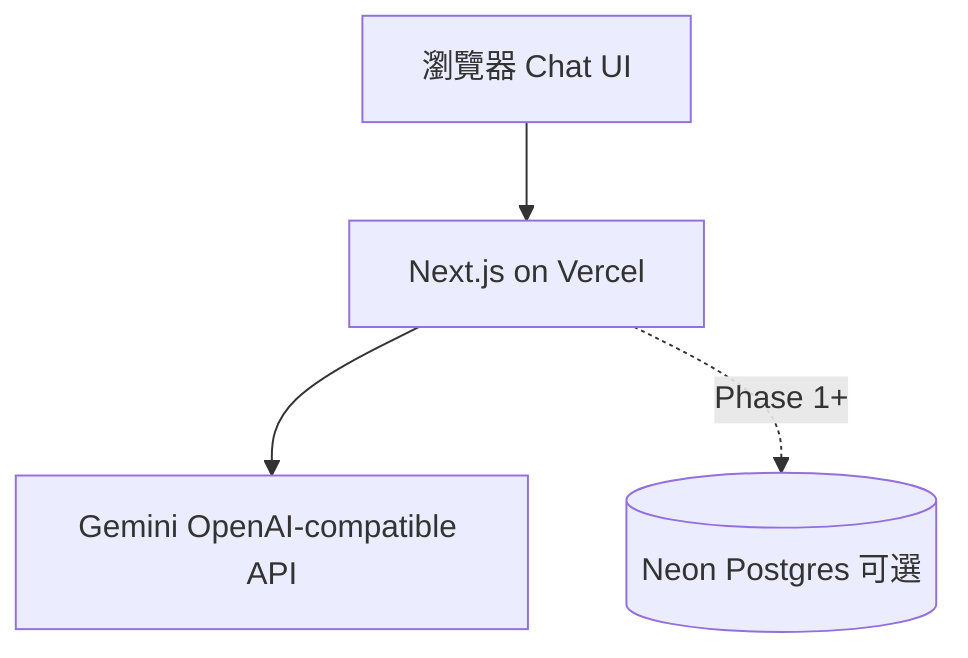

# LINE Bot → Web（Vercel）遷移 — 設計規格

**日期**：2026-05-23  
**狀態**：已核准  
**決策**：方案 1（Next.js 全棧）+ 身分 **A（匿名 session cookie）**  
**目標**：放棄 LINE + Render 部署鏈，改為瀏覽器直覺操作、Vercel 一鍵部署。

---

## 1. 背景

現有系統以 LINE webhook + Render 長駐 + in-process 佇列 + Playwright 為主，營運與除錯成本高。產品方改為 **Web 優先**，保留 AI 食譜核心，淘汰 LINE SDK 與 Flex/postback 流程。

---

## 2. 目標與非目標

### 目標

| ID | 說明 |
|----|------|
| W1 | 使用者開網址即可聊天並取得結構化食譜卡 |
| W2 | Vercel 部署：根目錄 `web/`，`git push` 即預覽 |
| W3 | 匿名 `chef_session` cookie 作為 `user_id`（與 DB 欄位相容） |
| W4 | 視覺延續 `design_tokens` 暖色主題 |

### 非目標（本階段）

- LINE webhook、Rich Menu、push message  
- Render `render.yaml` 作為主要部署路徑  
- Playwright 海報（改 Pillow 或純前端預覽）  
- 登入 OAuth（Phase 3+ 可選）  
- 完整移植 Python 所有 postback 指令

---

## 3. 架構



| 層 | 技術 | 備註 |
|----|------|------|
| 前端 | Next.js 14+ App Router、React、CSS variables | 根目錄 `web/` |
| API | Route Handlers `app/api/*` | 取代 FastAPI `/callback` |
| Session | Middleware 設定 `chef_session` HttpOnly cookie | UUID v4 |
| AI | `openai` npm + Gemini base URL | 移植 `SYSTEM_PROMPT`、JSON 修復邏輯 |
| DB | Neon（Vercel Marketplace） | Phase 1 接 `user_memory` 等現表 |
| 舊 Python | `app/` 保留至 Phase 2 歸檔 | 不再作為對外入口 |

---

## 4. 目錄結構

```
web/
  app/
    layout.tsx
    page.tsx              # Chat 首頁
    globals.css
    api/
      recipes/route.ts    # POST 生成食譜
      health/route.ts     # GET 存活
    legal/                # Phase 1 搬 disclaimer/privacy
  components/
    ChatPanel.tsx
    RecipeCard.tsx
  lib/
    session.ts
    ai/prompts.ts
    ai/generate-recipe.ts
    db/                   # Phase 1: @neondatabase/serverless
  middleware.ts
  package.json
  .env.example
```

**Vercel 設定**：Project Root Directory = `web`。

---

## 5. API 契約

### `POST /api/recipes`

**Request**

```json
{ "message": "番茄炒蛋" }
```

**Headers**：自動帶 `Cookie: chef_session=...`

**Response 200**

```json
{
  "ok": true,
  "recipe": {
    "recipe_name": "...",
    "kitchen_talk": [],
    "ingredients": [],
    "steps": [],
    "shopping_list": [],
    "estimated_total_cost": "..."
  }
}
```

**Errors**：400 缺 message；429 配額（Phase 1）；502 AI 失敗。

### Phase 1 新增

- `GET /api/recipes/history` — 讀 `user_memory`  
- `POST /api/favorites` — 收藏  
- `DELETE /api/memory` — 清除記憶  

---

## 6. Session（匿名 A）

- Cookie 名：`chef_session`  
- 屬性：`HttpOnly; Secure; SameSite=Lax; Max-Age=31536000`  
- 值：UUID → 對應 DB `user_id`  
- 無 cookie 時 `middleware` 自動發放  
- **不**存 PII；換裝置 = 新使用者（符合 A）

---

## 7. UI／UX

- 單欄聊天：使用者 bubble + 食譜卡 bubble  
- 送出後顯示「主廚研發中…」loading  
- 食譜卡：菜名、三人開場、食材、步驟、採買、估算成本  
- 頂部簡述 + 連結 legal（Phase 1）  
- 色票對齊 `#FFFAF5` / `#C8922A` / `#2A6049`（見 `design_tokens.py`）

---

## 8. AI 移植策略

| Python | TypeScript |
|--------|------------|
| `SYSTEM_PROMPT` | `lib/ai/prompts.ts` |
| `call_ai_with_retry` | `generateRecipe()` + JSON parse retry |
| `_fetch_ai_context` | Phase 1 `lib/db/memory.ts` |
| Deep Research | Phase 2，預設關 |
| 生圖 | Phase 2 API route |

環境變數（Vercel）：

- `GEMINI_API_KEY`（必填）  
- `MODEL_NAME`（預設 `gemini-2.0-flash` 或與現網一致）  
- `MAX_COMPLETION_TOKENS`（預設 1024）  
- `DATABASE_URL`（Phase 1，Neon）

---

## 9. 部署

1. Vercel Import repo → Root Directory **`web`**  
2. 設定 `GEMINI_API_KEY`  
3. Phase 1：連結 Neon → `DATABASE_URL`  
4. 自訂網域後更新 `PUBLIC_APP_BASE_URL`（若需 media URL）

**不再使用**：Render webhook URL、LINE Channel webhook。

---

## 10. 分階段交付

| Phase | 內容 | 狀態 |
|-------|------|------|
| **0** | Next 殼、session、POST `/api/recipes`、RecipeCard | 已交付 |
| **1** | Neon + memory／收藏／配額 | 已交付（2026-05-23） |
| **2** | 主圖、海報下載、菜系選擇 | 已交付（2026-05-23） |
| **3** | 封存 Python LINE 路徑、README 以 Web 為主 | 已交付（2026-05-23） |

---

## 11. 風險

| 風險 | 緩解 |
|------|------|
| Serverless 60s 上限 | 食譜 JSON 通常 <30s；超時改串流或 job 表 |
| 邏輯雙份維護 | 以 TS 為準；Python 標 deprecated |
| 匿名濫用 | Phase 1 配額 + IP rate limit（Vercel middleware 或 Upstash） |

---

## 12. 核准

- 2026-05-23：方案 1 + 匿名 A；用戶指示「用方案A執行」。
