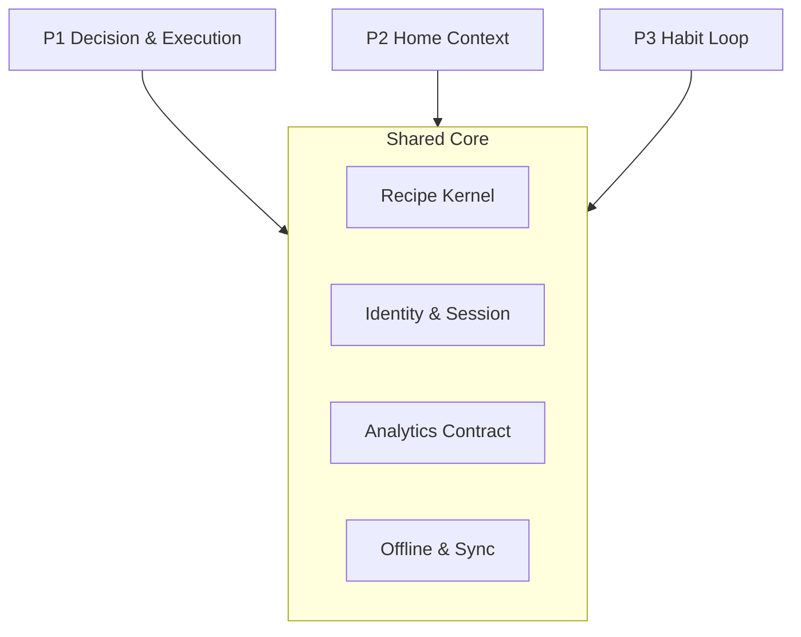

# 中長期架構規劃 — 三支柱並行

**狀態**：已核准（2026-05-26；產品 §2 + 技術一次搬遷 + 不增第四支柱）  
**日期**：2026-05-26  
**關聯**：
- 產品哲學與 Wave：[`2026-05-26-product-evolution-design.md`](2026-05-26-product-evolution-design.md)
- 工程 backlog：[`../../../TODOS.md`](../../../TODOS.md)
- UX：[`../../ux-spec.md`](../../ux-spec.md)

---

## 1. 目的與範圍

本文件定義 **3–36 個月** 可並行推進的 **三條戰略支柱**，同時規範 **產品模組邊界** 與 **技術平台分層**。不綁固定日曆；以 **能力閘門（G0–G3）** 決定何時加大各支柱投入。

**刻意排除**（本規劃不涵蓋）：

- 付費、訂閱、導購、廣告
- 第四支柱（分享／增長維持在既有 Sharing 能力內，不獨立成線）
- 社群瀑布流、食譜百科、完整 pantry ERP

**北極星（不變）**：

> 冰箱有什麼 → 今晚煮什麼 → 真的煮完 →（可選）下週少想一次

---

## 2. 三戰略支柱（並行）

| ID | 支柱 | 產品使命 | 對應哲學 | 主要交付 |
|----|------|----------|----------|----------|
| **P1** | 決策與執行（Decision & Execution） | 少做決策、真的煮完 | A 煮成功 | 決策卡、烹飪模式、完成回饋、烹飪漏斗 GA |
| **P2** | 家庭情境（Home Context） | 輸入像家裡真有什麼 | B 冰箱 | 今晚清 3–5 樣、生成帶清單、採買劃掉已有、步驟標註冰箱食材 |
| **P3** | 習慣迴圈（Habit Loop） | 每晚少想、週期一次搞定 | C 週節奏 | Tonight→週曆、採買聚合、晚餐提醒、7 日回訪 |



### 2.1 並行規則

- 三支柱可 **不同里程碑、不同 PR 批次** 推進。
- **禁止** 在未修訂本 spec／ADR 下變更：Recipe 對外型別、analytics 事件 **名稱**、anonymous `session` 語意、離線 mutation 契約。
- 支柱間整合僅透過 **已定義事件** 與 **application services**（見 §5、§6）。

### 2.2 與 Wave 對照

| Wave（產品 evolution） | 支柱 | 閘門 |
|------------------------|------|------|
| Wave 1（煮成功） | P1 | G1 |
| Wave 2（冰箱真實） | P2 | G1→G2 |
| Wave 3（週節奏） | P3 | G2→G3 |
| Wave 4（商業化） | — | **不在本文件** |

---

## 3. 產品模組邊界

| 模組 | 路由 | 職責 | 禁止 |
|------|------|------|------|
| **Tonight** | `/app` | 輸入、Quick Chips、生成流、結果頂決策卡 | 不直接寫 `meal_plans` |
| **Library & Detail** | `/app/library/*` | 收藏、刪除、份量、進 Cook、分享入口 | 不內嵌週曆 DnD |
| **Cook** | `/app/library/:id/cook` | 步驟機、計時、語音、Wake Lock、評分佇列 | 不觸發新食譜生成 |
| **Home Context** | Tonight sheet + 詳情採買區 | 今晚清單、劃掉已有、prompt 帶 pantry | 不做完整庫存 ERP |
| **Rhythm** | `/app/plan`、`/app/shopping`、提醒 | 週曆、採買聚合、推播排程 | 不複製 Cook 邏輯 |
| **Me** | `/app/me` | 偏好、配額、通知權限、分析開關 | 不內嵌生成 prompt 組裝 |

**跨模組黏合（允許）**：

| 觸發 | 消費者 | 行為 |
|------|--------|------|
| `recipe_generation_succeeded` | Library | 導向詳情／收藏提示 |
| `cooking_mode_completed` | P3（可選） | 建議「加入本週某日」 |
| `recipe_generation_succeeded` + pantry | P2 | `has_pantry_context` analytics |

**Sharing**：維持 [`public-sharing` 規格](2026-05-23-public-sharing.md) 橫切能力；不升格為第四支柱。

---

## 4. 技術平台架構

### 4.1 分層

```
┌─────────────────────────────────────────┐
│  App Router (app/, components/)         │  僅呼叫 application
├─────────────────────────────────────────┤
│  Application                            │  route handlers, hooks, orchestration
├─────────────────────────────────────────┤
│  Domain                                 │  純邏輯 + 型別，無 I/O
├─────────────────────────────────────────┤
│  Infrastructure (platform/)             │  drizzle, dexie, serwist, posthog, gemini
└─────────────────────────────────────────┘
```

**依賴規則**（ESLint／code review 強制）：

- `domain/*` **不得** import `platform/*`、`app/*`、`components/*`
- `application/*` 可 import `domain/*`、`platform/*`
- `components/*` 可 import `application/*`、`domain/*`（只讀型別／純函式）
- Route handlers 位於 `app/api/**`，實作委派至 `application/*`

### 4.2 目錄對照（一次搬遷目標）

**決策（2026-05-26）**：採 **單一里程碑一次搬遷**，不做長期雙軌 `lib/` 並存。搬遷完成後刪除舊路徑 re-export（僅允許 **一個 release** 的短期 shim，且須在同一 PR 系列內移除）。

| 現況 `web/lib/` | 搬遷後 |
|-----------------|--------|
| `ai/generate-recipe.ts`, `ai/recipe-flow.ts`, `ai/prompt-helpers.ts`, `ai/prompts.ts` | `domain/recipe/` |
| `recipe-payload.ts`, `recipe-steps.ts`, `recipe/decision-summary.ts`, `recipe-scale.ts`, `recipe-display.ts`, `recipe-memory.ts`, `recipe-progress.ts` | `domain/recipe/` |
| `cooking/*` | `domain/cook/` |
| （新建）pantry 邏輯 | `domain/pantry/` |
| `db/queries/meal-plans.ts`, `aggregation/shopping-list.ts`, `shopping/*` | `domain/plan/` |
| `db/*`（schema, queries, quota, preferences…） | `platform/db/` |
| `offline/*` | `platform/sync/` |
| `analytics/*` | `platform/analytics/` |
| `session.ts`, `sharing/visitor.ts` | `platform/identity/` |
| `api/client.ts`, `api/recipes.ts`, … | `application/api/` |
| `notifications/*` | `application/notifications/` |
| `flags.ts`, `config.ts`, `site-url.ts` | `platform/config/` |
| `copy/*`, `demo/*`, `marketing/*` | 保留 `web/lib/copy` 等 **presentation-adjacent** 或移至 `content/`（不進 domain） |

**`packages/shared-types`**：食譜／烹飪／計畫的 **跨邊界 DTO** 逐步下沉至此 package；`domain` 與 `application` 共用，避免 apps 以外 packages 互引違規。

### 4.3 一次搬遷執行順序

單一實作計畫內依序（同一 wave 的 architecture sprint）：

1. **建立目錄骨架** + ESLint `no-restricted-imports` 規則  
2. **搬 domain**（recipe、cook）+ 修正單測路徑  
3. **搬 platform**（db、sync、analytics、identity）  
4. **搬 application** + 更新 `app/api` import  
5. **更新 components/hooks** import  
6. **刪除** 舊 `web/lib` 已搬檔案；`pnpm -F @chef/web test` + `build` 全綠  
7. **文件**：`web/README.md` 目錄說明、`AGENTS.md` 一節「分層約定」

**風險緩解**：搬遷 PR 不夾帶 P2/P3 功能；功能 PR 在搬遷合併後基於新路徑開發。

### 4.4 Feature flags

| Flag | 支柱 | 預設 | 說明 |
|------|------|------|------|
| `NEXT_PUBLIC_COOKING_MODE_ENABLED` | P1 | 建議 on | 已有 |
| `NEXT_PUBLIC_PANTRY_TONIGHT`（新） | P2 | off | 今晚清單 UI + prompt |
| `NEXT_PUBLIC_MEAL_PLAN_ENABLED` | P3 | off | 已有；G2 後才建議 on |
| `NEXT_PUBLIC_SHARING_ENABLED` | 橫切 | on | 非第四支柱 |

集中定義於 `platform/config/flags.ts`（由現 `lib/flags.ts` 搬入）。

---

## 5. 資料模型

| 實體 | 支柱 | 儲存 | 備註 |
|------|------|------|------|
| `recipes`, `recipe_versions` | Core | Neon + Dexie | 單一真相 |
| `user_preferences` | Core | Neon | 飲食偏好 |
| `favorites_v2` | P1 | Neon | |
| `pantry_snapshot` | P2 | localStorage（Wave 2）→ 可選 Neon（G3 前評估） | 最多 5 項；非 ERP |
| `meal_plans`, shopping 聚合 | P3 | Neon | 已有 |
| Cook rating queue | P1 | IndexedDB / memory | `platform/sync` |

**Migration 政策**：延續 `relation-errors` 降級寫入；新表僅透過 numbered migration；搬遷不改 schema（除非 P2/P3 功能 PR 自帶）。

---

## 6. Analytics 契約

- **唯一登錄**：`platform/analytics/events.ts`（由現 `lib/analytics/events.ts` 搬入）。
- **禁止** rename 既有事件；新支柱只 **新增** 事件或 props。
- **建議新增**（實作時再開 PR）：

| 事件 / props | 支柱 |
|--------------|------|
| `pantry_tonight_saved` | P2 |
| `pantry_items_count` on `recipe_generation_started` | P2 |
| `meal_plan_added_from_tonight` | P3 |

- 仍禁止：`prompt`、過敏原文、token（blocklist 不變）。

漏斗定義見 [`docs/analytics/funnel-cook-success.md`](../../analytics/funnel-cook-success.md)。

---

## 7. 能力閘門（非日曆）

| 閘門 | 通過條件 | 解鎖 |
|------|----------|------|
| **G0** | PostHog 漏斗可讀；各階段 ≥50 樣本或 2 週觀察 | 三支柱可排程；P3 不大推 |
| **G1** | 煮完率有基線；[`PWA_DEVICE_QA.md`](../../PWA_DEVICE_QA.md) §3.5 烹飪 GA 勾選 | P2 開發 `PANTRY_TONIGHT` |
| **G2** | 含清冰箱情境之生成→完成率 ≥ 一般生成 | P3 預設推廣 `MEAL_PLAN` |
| **G3** | 7 日回訪相對 G0 上升 | 評估 OAuth／家庭共享（仍不談付費） |

---

## 8. 各支柱 backlog 摘要

### P1 — 決策與執行

| 狀態 | 項目 |
|------|------|
| 已交付 | 決策卡、`cooking_mode_*` source/duration、晚餐 SW periodicsync、刪除食譜 |
| 進行 | 烹飪 GA 真機清單 |
| 下一步 | `step_tip`（prompt+UI）；Playwright E2E 閘門 |

### P2 — 家庭情境

| 狀態 | 項目 |
|------|------|
| 待 G1 | `domain/pantry` + 今晚清單 UI |
| Wave 2 | 採買劃掉已有；步驟「用冰箱的 X」；剩菜續作（可選 1 text） |
| 不做 | 照片辨識、完整庫存（列 P2 遠期 [`TODOS.md`](../../../TODOS.md)） |

### P3 — 習慣迴圈

| 狀態 | 項目 |
|------|------|
| 已有 | `meal_plans`、採買頁、提醒排程（feature flag off） |
| 待 G2 | Tonight 成功 → 一鍵加入週曆；採買扣 pantry |
| 待 G3 | 週曆分享圖／連結；OAuth 架構預留 |

---

## 9. 架構債務（搬遷里程碑必含）

1. 一次目錄搬遷（§4.3）  
2. ESLint 分層邊界  
3. `shared-types` 收斂核心 DTO  
4. E2E：生成 → 收藏 → 烹飪 → 完成  
5. `web/README.md` + `AGENTS.md` 更新分層說明  

---

## 10. 審閾紀錄

| 項目 | 決定 |
|------|------|
| 三支柱 §2 | ✅ 同意 |
| 技術搬遷 | ✅ **一次搬**（§4.3） |
| 第四支柱 | ✅ 不新增 |
| 付費 | 排除 |

---

## 11. Spec self-review

| 檢查 | 結果 |
|------|------|
| Placeholder / TBD | 無；G3 後 OAuth 僅標「評估」 |
| 內部矛盾 | 與 product-evolution Wave 1–3 一致；Wave 4 明確排除 |
| 範圍 | 架構 + 閘門；實作拆至 architecture sprint plan |
| 歧義 | 搬遷與功能 PR 分離已寫死 |

---

## 修訂紀錄

| 日期 | 說明 |
|------|------|
| 2026-05-26 | 初版：brainstorming 核准（C 路線、D 框架、一次搬遷） |
