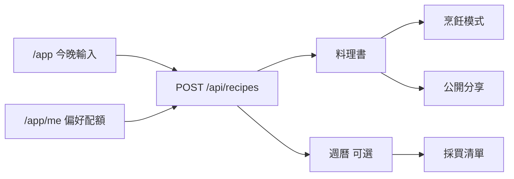
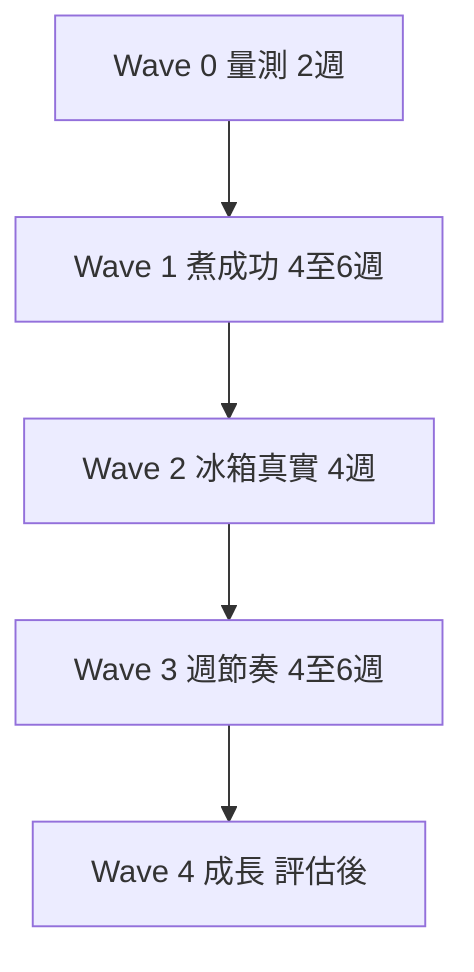

# 產品進化設計 — 貼近真實需求

**狀態**：已核准（2026-05-26；主軸 A 煮成功 + B 輕量冰箱延後 Wave 2）  
**日期**：2026-05-26  
**關聯**：[`docs/ux-spec.md`](../../ux-spec.md)、[`TODOS.md`](../../../TODOS.md) P1/P2

---

## 1. 問題陳述

職人料理大腦已完成 **Tonight 輸入 → 生成 → 料理書 → 烹飪模式 →（可選）週曆／採買** 的骨架。使用者真實需求並非「更多食譜文字」，而是：

1. **少做決策**（今晚煮什麼、買什麼）
2. **用掉家裡已有食材**（清冰箱、少浪費）
3. **真的煮成功**（廚房情境下的步驟與計時）
4. **下週少想一次**（週期與採買）

瓶頸在 **輸入真實性、執行陪跑、習慣迴圈、可量測成效**——不是再堆生成 UI。

---

## 2. 產品定位（不變）

> **冰箱有什麼，今晚就煮什麼** — 忙碌家庭的 30 分鐘晚餐決策與下廚陪跑。

差異化（相對通用 ChatGPT／食譜站）：

> 我們賣的不是食譜字數，而是 **「今晚這一餐從決策到收鍋」的可靠路徑**。

---

## 3. 現況能力圖

| 區塊 | 已有 | 規格／程式參考 |
|------|------|----------------|
| Tonight | placeholder 輪播、Quick Chips、今晚靈感、最近食譜 | [`docs/ux-spec.md`](../../ux-spec.md) P0-1 |
| 生成 | 家庭 prompt、飲食偏好、text/image 配額 | [`web/lib/ai/prompts.ts`](../../../web/lib/ai/prompts.ts) |
| 料理書 | 收藏、刪除、離線快取 | [`web/lib/offline/`](../../../web/lib/offline/) |
| 烹飪 | 計時、語音、Wake Lock、完成評分 | [`docs/superpowers/specs/2026-05-23-cooking-mode.md`](2026-05-23-cooking-mode.md) |
| 週曆 | `meal_plans`、DnD、採買聚合 | `NEXT_PUBLIC_MEAL_PLAN_ENABLED=1` |
| 推播 | 設定卡 + client alarm + SW 讀 metadata | [`web/lib/notifications/dinner-reminder-scheduler.ts`](../../../web/lib/notifications/dinner-reminder-scheduler.ts) |
| 分析 | PostHog、`capture()` 消毒 | [`web/lib/analytics/events.ts`](../../../web/lib/analytics/events.ts) |

---

## 4. 三種進化哲學

| ID | 哲學 | 核心信念 | 典型功能 | 主要風險 |
|----|------|----------|----------|----------|
| **A** | 煮成功優先（Outcome-first） | 價值 = 完成一餐比例，非生成次數 | 烹飪 GA、決策卡、完成回饋入庫、漏斗 | 生成脫離廚房現實則陪跑無效 |
| **B** | 冰箱優先（Inventory-first） | 真實輸入是「家裡有什麼」 | 今晚清 3 樣、pantry 勾選、採買劃掉已有 | 庫存維護成本高 |
| **C** | 節奏優先（Rhythm-first） | 每晚想菜最耗腦；週期一次省六天 | 週曆從 Tonight 長出、晚餐 SW、採買扣 pantry | 需跨裝置／登入才完整 |

### 4.1 決策（3–6 個月）

**主軸 A + 差異化 B + 留存 C**，不四線平行大做。

| 優先 | 哲學 | 理由 |
|------|------|------|
| 1 | A | 已有 cook 路由與 UX Phase 1–7；須先證明「用你煮成功」 |
| 2 | B | 與定位「冰箱」一致；最小形態是「今晚清掉 N 樣」非 ERP |
| 3 | C | 週曆已實作但預設關閉；等 `cooking_mode_completed` 有基線再加大 |

---

## 5. 四條情境 → 進化 backlog

### 5.A 下班趕回家長（30 分鐘開飯）

**Jobs**：快決定、孩子能吃、步驟可執行、少買用不到的。

| 狀態 | 項目 |
|------|------|
| 已有 | Quick chips、兒童餐情境、prep/cook 分鐘、飲食偏好 MVP |
| Wave 1 | **決策卡**（時間／人數／辣度／需購買 N 樣）置於結果頂部 |
| Wave 1 | 配額耗盡顯示「明日 00:00（Asia/Taipei）」重置提示 |
| Wave 2 | **一鍵簡化步驟**（二次生成，扣 1 text） |
| 量測 | `recipe_generation_succeeded` → `cooking_mode_started` → `cooking_mode_completed` |

**設計原則**：AI 角色是 **決策助理**，預設答案可直接開火。

---

### 5.B 清冰箱／零浪費

**Jobs**：盤點 → 湊菜 → 優先快壞 → 少去超市。

| 狀態 | 項目 |
|------|------|
| 已有 | chip「清冰箱」、placeholder 文案、`shopping_list` JSON |
| Wave 2 | **今晚清單**（最多 5 項，僅 session／localStorage，可選持久 pantry） |
| Wave 2 | 結果頁 **採買劃掉已有**；步驟標註「用冰箱的 X」 |
| Wave 2 | 烹飪完成後 **剩菜續作**（1 次 text，可選） |
| Wave 4+ | 照片辨識（[`TODOS.md`](../../../TODOS.md) P2） |

**設計原則**：使用者願維護的最小狀態 = **今晚要清掉的 3–5 樣**，不是完整庫存。

---

### 5.C 下廚陪跑（烹飪成功）

**Jobs**：油手操作、不漏步、計時、煮壞能救。

| 狀態 | 項目 |
|------|------|
| 已有 | `/app/library/:id/cook`、計時、語音、Wake Lock、`cooking_mode_*` 事件、離線 rating queue |
| Wave 1 | **烹飪模式 GA**：iPhone 真機清單通過（[`docs/PWA_DEVICE_QA.md`](../../PWA_DEVICE_QA.md) §3 擴充） |
| Wave 1 | 詳情預設路徑強化：食材區下方主 CTA → cook |
| Wave 1 | 完成評分 **可靠寫入 DB**（含離線佇列驗收） |
| Wave 2 | 步驟 `step_tip`（prompt + UI 一行常見錯誤） |
| 不做先 | 無限步驟動畫、第三方 TTS 套件 |

**設計原則**：差異 = **廚房狀態機**（當前步、計時、下一動作），非靜態頁。

---

### 5.D 一週家庭餐計畫

**Jobs**：週末想一次、每天照表、採買一次、食材跨日共用。

| 狀態 | 項目 |
|------|------|
| 已有 | `meal_plans`、週曆、採買頁、`meal_plan_recipe_added` 事件 |
| Wave 3 | Tonight 生成成功 → **加入本週某日** 一鍵 |
| Wave 3 | 採買清單 **扣除 pantry**；標註跨日共用食材 |
| Wave 3 | 週曆 **分享圖／連結**（無需 OAuth） |
| Wave 4 | OAuth、家庭共享（P2） |

**設計原則**：週計畫從 **今晚這一餐** 自然長出，非第二套產品入口。

---

## 6. 分波路線圖（Wave 0–4）

| 波次 | 目標 | 主要交付 | 退出條件 |
|------|------|----------|----------|
| **0** | 知道痛在哪 | PostHog 漏斗儀表板；5 人訪談腳本 | 漏斗各階段有 ≥50 樣本或 2 週 |
| **1** | 煮成功率 ↑ | 決策卡、cook GA、完成入庫、晚餐 SW 定時 | cook 完成率基線 + 真機清單全過 |
| **2** | 清冰箱可信 | 今晚清單、採買劃掉、剩菜續作 | 含清冰箱 prompt 的生成 → 完成率 ≥ 不含時 |
| **3** | 週節奏留存 | Tonight→週曆、採買扣 pantry | 7 日回訪 ↑（對照 Wave 0） |
| **4** | 商業化 | OAuth、付費、照片辨識、導購 | Wave 1–3 指標達標後啟動 |

實作計畫：**Wave 1** → [`docs/superpowers/plans/2026-05-26-wave1-cook-success-plan.md`](../plans/2026-05-26-wave1-cook-success-plan.md)

---

## 7. 指標與事件契約

### 7.1 北極星（Wave 1 起）

| 指標 | 定義 | 事件 |
|------|------|------|
| **煮完率** | 進入 cook 且完成 / 進入 cook | `cooking_mode_started` → `cooking_mode_completed` |
| **生成成功率** | 成功生成 / 開始生成 | `recipe_generation_succeeded` / `recipe_generation_started` |
| **決策到開火** | 生成成功後 24h 內 cook_started | 同上 + 時間窗 |

既有事件（勿改名，僅補 instrument）：見 [`web/lib/analytics/events.ts`](../../../web/lib/analytics/events.ts)。

### 7.2 Wave 1 新增建議屬性（皆經 `sanitizeAnalyticsProps`）

| 事件 | 建議 props | 說明 |
|------|------------|------|
| `cooking_mode_started` | `source: detail \| sticky_cta \| demo` | 區分入口 |
| `cooking_mode_completed` | `duration_bucket`, `rating_bucket` | 不含原文 |
| `recipe_generation_succeeded` | `has_decision_card: true` | 決策卡上線後 |
| `dinner_reminder_fired` | `channel: sw \| client` | SW 推播驗收 |

禁止送入：`prompt`、食材原文、過敏原、token（已 blocklist）。

### 7.3 PostHog 漏斗（Wave 0）

1. `landing_primary_cta_clicked` 或 `page_viewed` `/`
2. `recipe_generation_started`
3. `recipe_generation_succeeded`
4. `recipe_viewed`
5. `cooking_mode_started`
6. `cooking_mode_completed`

儀表板名稱建議：`Funnel — Tonight to Cook Done (7d)`。

---

## 8. 訪談腳本（Wave 0，5 人）

每人 20 分鐘，對象：過去 7 天有下廚的家庭主力煮食者。

1. 上週幾天在家煮？最卡的是「想菜」還是「實作」？
2. 打開 app 前，腦中已有食材清單嗎？會先開冰箱嗎？
3. 看到 AI 食譜後，有沒有放棄？原因（太複雜／缺料／小孩不吃）？
4. 烹飪模式有用嗎？哪一步會卡住？
5. 願意每天花 30 秒維護「冰箱清單」嗎？還是只想每次說一句？

記錄寫入內部筆記（不入 repo），結論回饋 Wave 1 優先序。

---

## 9. 刻意不做（YAGNI）

- 社群瀑布流、食譜百科、無限聊天人格
- 完整 pantry ERP（Wave 2 前）
- 未驗證前加大力推週曆（預設仍關 `MEAL_PLAN`）
- Analytics 收集 prompt／過敏原文

---

## 10. 審閱門檻

| 項目 | 狀態 |
|------|------|
| 主軸 A + B 輕量 | **建議採納**（待產品方勾選） |
| Wave 1 實作計畫 | 已撰寫，見 plans 連結 |
| 程式變更 | **本文件不觸發實作**；依 Wave 1 plan 執行 |

產品方請確認：

- [x] 同意主軸 A（煮成功）為 Wave 1 唯一必達
- [x] 同意 B 延後至 Wave 2（今晚清 3 樣）
- [x] 同意 C 延後至 Wave 3（週曆推廣）

已於 2026-05-26 核准；Wave 1 實作進行中／已交付見 `CHANGELOG.md`。

---

## 11. Spec self-review（2026-05-26）

| 檢查 | 結果 |
|------|------|
| Placeholder / TBD | 無；Wave 4 僅標「評估後」為刻意邊界 |
| 內部矛盾 | 無；事件名與現有 `cooking_mode_*` 一致 |
| 範圍 | 單一產品路線文件；實作拆至 Wave 1 plan |
| 歧義 | 決策卡欄位在 Wave 1 plan 具體化 |

---

## 修訂紀錄

| 日期 | 說明 |
|------|------|
| 2026-05-26 | 初版：brainstorming 全景核准寫入 |
